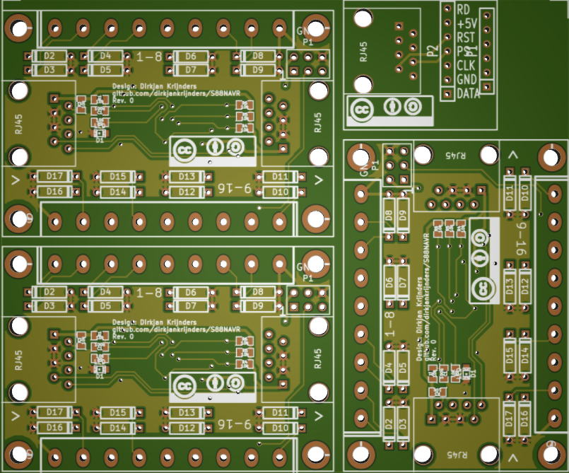

S88NAVR
=======

An implementation of the S88-N protocol for Atmel Atmega[8/48/88/168/328] microcontrollers. So far, an Arduino Pro Mini version and the actual board have been tested.

Goal
----

The goal is the make small, cheap reliable feedback modules for the S88 system. Hence choice for the microcontroller, one IC instead of the three discreet ones. The choice for SMD technology for a small board with components on both sides, as most will be hand soldered. The reliability comes from the use of the S88-N Cabling and timing, input diodes and a RC input network. If wanted the RC network and diodes can be short to minimize cost when needed, leaving 10 components (2 connectors, an uc, two caps and five resistors). The RC-network kills spike, the 1N4148 does the same ensuring the reliability of the detection, the big diode make sure the "detection" rail acts a as a ground return as well ensuring reliable operation of the track. 
The board is designed for production by cheap production houses like seeedstudio's PCB service. Goal is to stay under €5.00 for the fully build PCB.

State
-----
The parts for the first revision (Rev. 0) have been ordered, including the PCB at Seeedstudios. See below for an image and a BOM of the non-standard parts.
. The total is still enough under €5.00 to fit the passives and stand-offs (no prices because then come from my stock).
<table>
<tr>
<th>Part</th><th>#</th><th>Conrad #</th><th>price* (€)</th>
</tr>
<tr><td>IC1</td><td>1</td><td>154273</td><td>2.41</td></tr>
<tr><td>P2,P3</td><td>2</td><td>731817+731830</td><td>0.71</td></tr>
<tr><td>J1,J2</td><td>2</td><td>716232</td><td>0.58</td></tr>
<tr><td>PCB</td><td>1</td><td>Seeed</td><td>0.64</td></tr>
<tr><td colspan=3>Total</td><td>4.34</td></tr>
</table>
*When ordering 10+ quantities

The boards came back from Seeedstudios and they work, only one small issue where a track was not connected, update in as rev 0.1. Only in the kicad files, the change is too small to spin a new board.
LICENSE
-------

Both hardware and firmware are placed under the Creative Commons Attribution-ShareAlike 3.0 Unported License. See <http://creativecommons.org/licenses/by-sa/3.0/> and License.txt for more details.

Copyright 2013
Dirkjan Krijnders
<dirkjan@krijnders.net>
